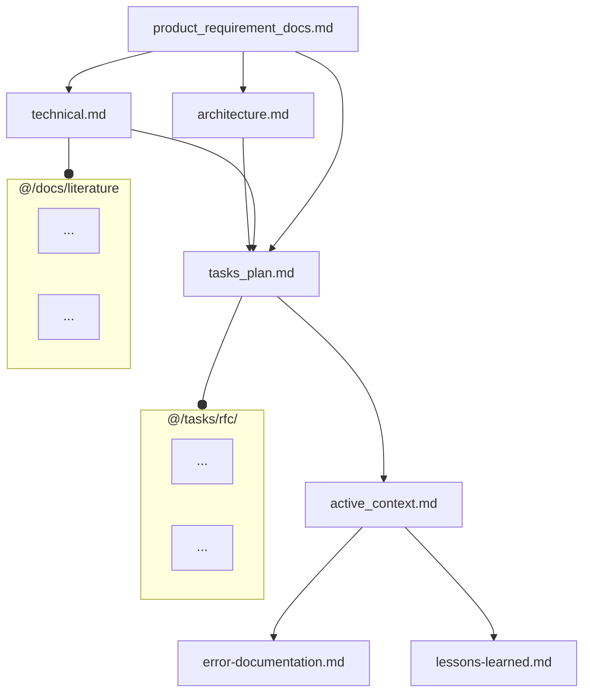
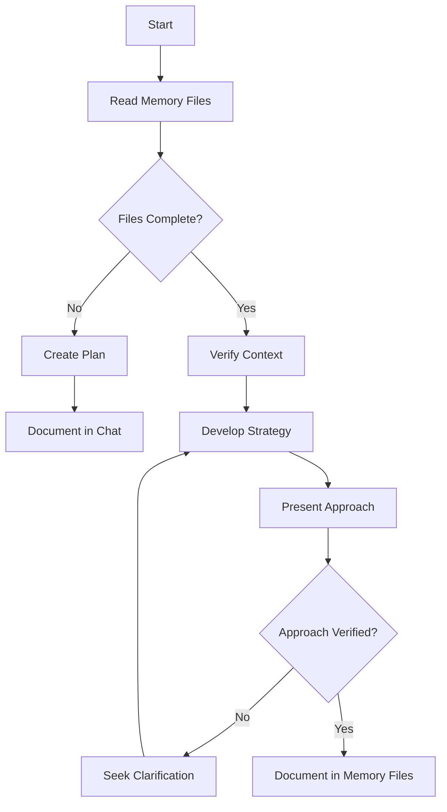
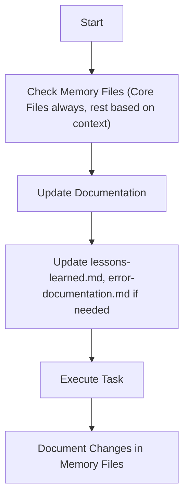
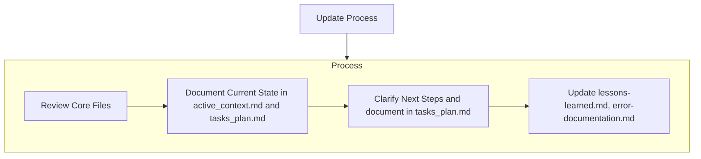
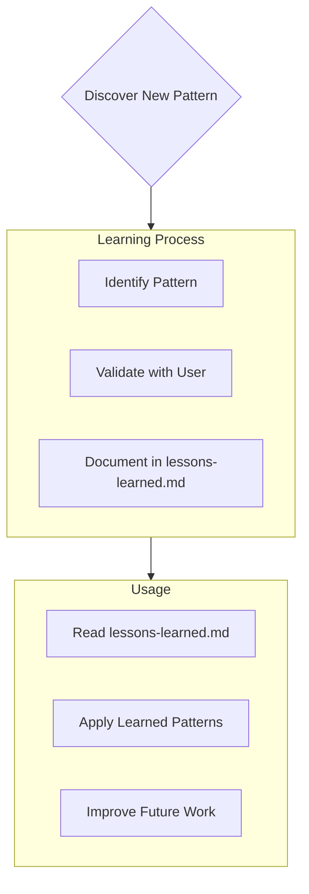
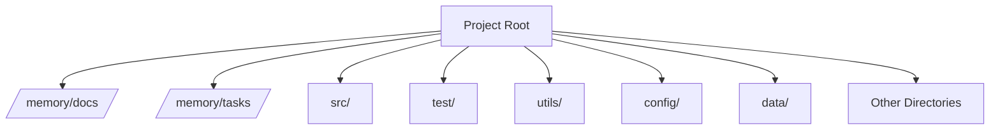

# NEVER use mix phx.server or terminal commands for database operations - ALWAYS use Tidewave MCP Tools <MANDATORY>
This is a web application written using the Phoenix web framework.

## reglas del juego que estamos creando
- Si necesitas contexto de las reglas del juego lee .github/rules_game_eight.md <MANDATORY>
## Project guidelines
- Use `mix precommit` alias when you are done with all changes and fix any pending issues
- Use the already included and available `:req` (`Req`) library for HTTP requests, **avoid** `:httpoison`, `:tesla`, and `:httpc`. Req is included by default and is the preferred HTTP client for Phoenix apps
- **CRITICAL:** NEVER EVER use `mix phx.server` - ALWAYS use Tidewave MCP tools for ALL operations

## Tidewave MCP Tools

ALWAYS use the following Tidewave MCP tools instead of the Phoenix server or other tools:

### Elixir Project Analysis Tools:
- `mcp_orvix-mcp_execute_sql_query` - Execute SQL queries against the Ecto repository
- `mcp_orvix-mcp_get_docs` - Get documentation for modules and functions
- `mcp_orvix-mcp_get_ecto_schemas` - List all Ecto schema modules and their file paths
- `mcp_orvix-mcp_get_logs` - Get log output, excluding logs from other tool calls
- `mcp_orvix-mcp_get_package_location` - Get the location of dependency packages
- `mcp_orvix-mcp_get_source_location` - Get source location for modules and functions
- `mcp_orvix-mcp_project_eval` - Evaluate Elixir code in the context of the project
- `mcp_orvix-mcp_search_package_docs` - Search Hex documentation for project dependencies

### Database Tools:
- `pgsql_bulk_load_csv` - Bulk-load CSV files into PostgreSQL tables
- `pgsql_connect` - Connect to PostgreSQL database servers
- `pgsql_db_context` - Get database schema context and CREATE scripts
- `pgsql_describe_csv` - Describe CSV file structure using Frictionless
- `pgsql_disconnect` - Disconnect from PostgreSQL database servers
- `pgsql_list_databases` - List all databases on PostgreSQL server
- `pgsql_list_servers` - List all registered PostgreSQL servers
- `pgsql_modify` - Execute DDL and DML statements to modify database
- `pgsql_open_script` - Open SQL scripts in editor for review
- `pgsql_query` - Execute read-only SQL queries
- `pgsql_visualize_schema` - Open interactive database schema visualization

**NEVER use the Phoenix server (`mix phx.server`) or terminal commands for database operations. Always use the appropriate MCP tools listed above.**

## CRITICAL RULES - MCP Tools Usage

⚠️ **MANDATORY:** Never use the following commands:
- `mix phx.server`
- `iex -S mix phx.server`
- Any direct Phoenix server commands
- Direct database terminal commands

✅ **ALWAYS USE:** Tidewave MCP tools for:
- Database operations: Use `pgsql_*` tools
- Elixir evaluation: Use `mcp_orvix-mcp_project_eval`
- Code analysis: Use `mcp_orvix-mcp_*` tools
- Testing: Use appropriate MCP testing tools
### Phoenix v1.8 guidelines

- **Always** begin your LiveView templates with `<Layouts.app flash={@flash} ...>` which wraps all inner content
- The `MyAppWeb.Layouts` module is aliased in the `my_app_web.ex` file, so you can use it without needing to alias it again
- Anytime you run into errors with no `current_scope` assign:
  - You failed to follow the Authenticated Routes guidelines, or you failed to pass `current_scope` to `<Layouts.app>`
  - **Always** fix the `current_scope` error by moving your routes to the proper `live_session` and ensure you pass `current_scope` as needed
- Phoenix v1.8 moved the `<.flash_group>` component to the `Layouts` module. You are **forbidden** from calling `<.flash_group>` outside of the `layouts.ex` module
- Out of the box, `core_components.ex` imports an `<.icon name="hero-x-mark" class="w-5 h-5"/>` component for for hero icons. **Always** use the `<.icon>` component for icons, **never** use `Heroicons` modules or similar
- **Always** use the imported `<.input>` component for form inputs from `core_components.ex` when available. `<.input>` is imported and using it will will save steps and prevent errors
- If you override the default input classes (`<.input class="myclass px-2 py-1 rounded-lg">)`) class with your own values, no default classes are inherited, so your
custom classes must fully style the input

<!-- usage-rules-start -->
<!-- phoenix:elixir-start -->
## Elixir guidelines

- Elixir lists **do not support index based access via the access syntax**

  **Never do this (invalid)**:

      i = 0
      mylist = ["blue", "green"]
      mylist[i]

  Instead, **always** use `Enum.at`, pattern matching, or `List` for index based list access, ie:

      i = 0
      mylist = ["blue", "green"]
      Enum.at(mylist, i)

- Elixir variables are immutable, but can be rebound, so for block expressions like `if`, `case`, `cond`, etc
  you *must* bind the result of the expression to a variable if you want to use it and you CANNOT rebind the result inside the expression, ie:

      # INVALID: we are rebinding inside the `if` and the result never gets assigned
      if connected?(socket) do
        socket = assign(socket, :val, val)
      end

      # VALID: we rebind the result of the `if` to a new variable
      socket =
        if connected?(socket) do
          assign(socket, :val, val)
        end

- **Never** nest multiple modules in the same file as it can cause cyclic dependencies and compilation errors
- **Never** use map access syntax (`changeset[:field]`) on structs as they do not implement the Access behaviour by default. For regular structs, you **must** access the fields directly, such as `my_struct.field` or use higher level APIs that are available on the struct if they exist, `Ecto.Changeset.get_field/2` for changesets
- Elixir's standard library has everything necessary for date and time manipulation. Familiarize yourself with the common `Time`, `Date`, `DateTime`, and `Calendar` interfaces by accessing their documentation as necessary. **Never** install additional dependencies unless asked or for date/time parsing (which you can use the `date_time_parser` package)
- Don't use `String.to_atom/1` on user input (memory leak risk)
- Predicate function names should not start with `is_` and should end in a question mark. Names like `is_thing` should be reserved for guards
- Elixir's builtin OTP primitives like `DynamicSupervisor` and `Registry`, require names in the child spec, such as `{DynamicSupervisor, name: MyApp.MyDynamicSup}`, then you can use `DynamicSupervisor.start_child(MyApp.MyDynamicSup, child_spec)`
- Use `Task.async_stream(collection, callback, options)` for concurrent enumeration with back-pressure. The majority of times you will want to pass `timeout: :infinity` as option

## Mix guidelines

- Read the docs and options before using tasks (by using `mix help task_name`)
- To debug test failures, run tests in a specific file with `mix test test/my_test.exs` or run all previously failed tests with `mix test --failed`
- `mix deps.clean --all` is **almost never needed**. **Avoid** using it unless you have good reason
<!-- phoenix:elixir-end -->
<!-- phoenix:phoenix-start -->
## Phoenix guidelines

- Remember Phoenix router `scope` blocks include an optional alias which is prefixed for all routes within the scope. **Always** be mindful of this when creating routes within a scope to avoid duplicate module prefixes.

- You **never** need to create your own `alias` for route definitions! The `scope` provides the alias, ie:

      scope "/admin", AppWeb.Admin do
        pipe_through :browser

        live "/users", UserLive, :index
      end

  the UserLive route would point to the `AppWeb.Admin.UserLive` module

- `Phoenix.View` no longer is needed or included with Phoenix, don't use it
<!-- phoenix:phoenix-end -->
<!-- phoenix:ecto-start -->
## Ecto Guidelines

- **Always** preload Ecto associations in queries when they'll be accessed in templates, ie a message that needs to reference the `message.user.email`
- Remember `import Ecto.Query` and other supporting modules when you write `seeds.exs`
- `Ecto.Schema` fields always use the `:string` type, even for `:text`, columns, ie: `field :name, :string`
- `Ecto.Changeset.validate_number/2` **DOES NOT SUPPORT the `:allow_nil` option**. By default, Ecto validations only run if a change for the given field exists and the change value is not nil, so such as option is never needed
- You **must** use `Ecto.Changeset.get_field(changeset, :field)` to access changeset fields
- Fields which are set programatically, such as `user_id`, must not be listed in `cast` calls or similar for security purposes. Instead they must be explicitly set when creating the struct
<!-- phoenix:ecto-end -->
<!-- phoenix:html-start -->
## Phoenix HTML guidelines

- Phoenix templates **always** use `~H` or .html.heex files (known as HEEx), **never** use `~E`
- **Always** use the imported `Phoenix.Component.form/1` and `Phoenix.Component.inputs_for/1` function to build forms. **Never** use `Phoenix.HTML.form_for` or `Phoenix.HTML.inputs_for` as they are outdated
- When building forms **always** use the already imported `Phoenix.Component.to_form/2` (`assign(socket, form: to_form(...))` and `<.form for={@form} id="msg-form">`), then access those forms in the template via `@form[:field]`
- **Always** add unique DOM IDs to key elements (like forms, buttons, etc) when writing templates, these IDs can later be used in tests (`<.form for={@form} id="product-form">`)
- For "app wide" template imports, you can import/alias into the `my_app_web.ex`'s `html_helpers` block, so they will be available to all LiveViews, LiveComponent's, and all modules that do `use MyAppWeb, :html` (replace "my_app" by the actual app name)

- Elixir supports `if/else` but **does NOT support `if/else if` or `if/elsif`. **Never use `else if` or `elseif` in Elixir**, **always** use `cond` or `case` for multiple conditionals.

  **Never do this (invalid)**:

      <%= if condition do %>
        ...
      <% else if other_condition %>
        ...
      <% end %>

  Instead **always** do this:

      <%= cond do %>
        <% condition -> %>
          ...
        <% condition2 -> %>
          ...
        <% true -> %>
          ...
      <% end %>

- HEEx require special tag annotation if you want to insert literal curly's like `{` or `}`. If you want to show a textual code snippet on the page in a `<pre>` or `<code>` block you *must* annotate the parent tag with `phx-no-curly-interpolation`:

      <code phx-no-curly-interpolation>
        let obj = {key: "val"}
      </code>

  Within `phx-no-curly-interpolation` annotated tags, you can use `{` and `}` without escaping them, and dynamic Elixir expressions can still be used with `<%= ... %>` syntax

- HEEx class attrs support lists, but you must **always** use list `[...]` syntax. You can use the class list syntax to conditionally add classes, **always do this for multiple class values**:

      <a class={[
        "px-2 text-white",
        @some_flag && "py-5",
        if(@other_condition, do: "border-red-500", else: "border-blue-100"),
        ...
      ]}>Text</a>

  and **always** wrap `if`'s inside `{...}` expressions with parens, like done above (`if(@other_condition, do: "...", else: "...")`)

  and **never** do this, since it's invalid (note the missing `[` and `]`):

      <a class={
        "px-2 text-white",
        @some_flag && "py-5"
      }> ...
      => Raises compile syntax error on invalid HEEx attr syntax

- **Never** use `<% Enum.each %>` or non-for comprehensions for generating template content, instead **always** use `<%= for item <- @collection do %>`
- HEEx HTML comments use `<%!-- comment --%>`. **Always** use the HEEx HTML comment syntax for template comments (`<%!-- comment --%>`)
- HEEx allows interpolation via `{...}` and `<%= ... %>`, but the `<%= %>` **only** works within tag bodies. **Always** use the `{...}` syntax for interpolation within tag attributes, and for interpolation of values within tag bodies. **Always** interpolate block constructs (if, cond, case, for) within tag bodies using `<%= ... %>`.

  **Always** do this:

      

        {@my_assign}
        <%= if @some_block_condition do %>
          {@another_assign}
        <% end %>
      

  and **Never** do this – the program will terminate with a syntax error:

      <%!-- THIS IS INVALID NEVER EVER DO THIS --%>
      
">
        {if @invalid_block_construct do}
        {end}
      

<!-- phoenix:html-end -->
<!-- phoenix:liveview-start -->
## Phoenix LiveView guidelines

- **Never** use the deprecated `live_redirect` and `live_patch` functions, instead **always** use the `<.link navigate={href}>` and  `<.link patch={href}>` in templates, and `push_navigate` and `push_patch` functions LiveViews
- **Avoid LiveComponent's** unless you have a strong, specific need for them
- LiveViews should be named like `AppWeb.WeatherLive`, with a `Live` suffix. When you go to add LiveView routes to the router, the default `:browser` scope is **already aliased** with the `AppWeb` module, so you can just do `live "/weather", WeatherLive`
- Remember anytime you use `phx-hook="MyHook"` and that js hook manages its own DOM, you **must** also set the `phx-update="ignore"` attribute
- **Never** write embedded `<script>` tags in HEEx. Instead always write your scripts and hooks in the `assets/js` directory and integrate them with the `assets/js/app.js` file

### LiveView streams

- **Always** use LiveView streams for collections for assigning regular lists to avoid memory ballooning and runtime termination with the following operations:
  - basic append of N items - `stream(socket, :messages, [new_msg])`
  - resetting stream with new items - `stream(socket, :messages, [new_msg], reset: true)` (e.g. for filtering items)
  - prepend to stream - `stream(socket, :messages, [new_msg], at: -1)`
  - deleting items - `stream_delete(socket, :messages, msg)`

- When using the `stream/3` interfaces in the LiveView, the LiveView template must 1) always set `phx-update="stream"` on the parent element, with a DOM id on the parent element like `id="messages"` and 2) consume the `@streams.stream_name` collection and use the id as the DOM id for each child. For a call like `stream(socket, :messages, [new_msg])` in the LiveView, the template would be:

      

        

          {msg.text}
        

      

- LiveView streams are *not* enumerable, so you cannot use `Enum.filter/2` or `Enum.reject/2` on them. Instead, if you want to filter, prune, or refresh a list of items on the UI, you **must refetch the data and re-stream the entire stream collection, passing reset: true**:

      def handle_event("filter", %{"filter" => filter}, socket) do
        # re-fetch the messages based on the filter
        messages = list_messages(filter)

        {:noreply,
        socket
        |> assign(:messages_empty?, messages == [])
        # reset the stream with the new messages
        |> stream(:messages, messages, reset: true)}
      end

- LiveView streams *do not support counting or empty states*. If you need to display a count, you must track it using a separate assign. For empty states, you can use Tailwind classes:

      

        
No tasks yet

        

          {task.name}
        

      

  The above only works if the empty state is the only HTML block alongside the stream for-comprehension.

- **Never** use the deprecated `phx-update="append"` or `phx-update="prepend"` for collections

### LiveView tests

- `Phoenix.LiveViewTest` module and `LazyHTML` (included) for making your assertions
- Form tests are driven by `Phoenix.LiveViewTest`'s `render_submit/2` and `render_change/2` functions
- Come up with a step-by-step test plan that splits major test cases into small, isolated files. You may start with simpler tests that verify content exists, gradually add interaction tests
- **Always reference the key element IDs you added in the LiveView templates in your tests** for `Phoenix.LiveViewTest` functions like `element/2`, `has_element/2`, selectors, etc
- **Never** tests again raw HTML, **always** use `element/2`, `has_element/2`, and similar: `assert has_element?(view, "#my-form")`
- Instead of relying on testing text content, which can change, favor testing for the presence of key elements
- Focus on testing outcomes rather than implementation details
- Be aware that `Phoenix.Component` functions like `<.form>` might produce different HTML than expected. Test against the output HTML structure, not your mental model of what you expect it to be
- When facing test failures with element selectors, add debug statements to print the actual HTML, but use `LazyHTML` selectors to limit the output, ie:

      html = render(view)
      document = LazyHTML.from_fragment(html)
      matches = LazyHTML.filter(document, "your-complex-selector")
      IO.inspect(matches, label: "Matches")

### Form handling

#### Creating a form from params

If you want to create a form based on `handle_event` params:

    def handle_event("submitted", params, socket) do
      {:noreply, assign(socket, form: to_form(params))}
    end

When you pass a map to `to_form/1`, it assumes said map contains the form params, which are expected to have string keys.

You can also specify a name to nest the params:

    def handle_event("submitted", %{"user" => user_params}, socket) do
      {:noreply, assign(socket, form: to_form(user_params, as: :user))}
    end

#### Creating a form from changesets

When using changesets, the underlying data, form params, and errors are retrieved from it. The `:as` option is automatically computed too. E.g. if you have a user schema:

    defmodule MyApp.Users.User do
      use Ecto.Schema
      ...
    end

And then you create a changeset that you pass to `to_form`:

    %MyApp.Users.User{}
    |> Ecto.Changeset.change()
    |> to_form()

Once the form is submitted, the params will be available under `%{"user" => user_params}`.

In the template, the form form assign can be passed to the `<.form>` function component:

    <.form for={@form} id="todo-form" phx-change="validate" phx-submit="save">
      <.input field={@form[:field]} type="text" />
    </.form>

Always give the form an explicit, unique DOM ID, like `id="todo-form"`.

#### Avoiding form errors

**Always** use a form assigned via `to_form/2` in the LiveView, and the `<.input>` component in the template. In the template **always access forms this**:

    <%!-- ALWAYS do this (valid) --%>
    <.form for={@form} id="my-form">
      <.input field={@form[:field]} type="text" />
    </.form>

And **never** do this:

    <%!-- NEVER do this (invalid) --%>
    <.form for={@changeset} id="my-form">
      <.input field={@changeset[:field]} type="text" />
    </.form>

- You are FORBIDDEN from accessing the changeset in the template as it will cause errors
- **Never** use `<.form let={f} ...>` in the template, instead **always use `<.form for={@form} ...>`**, then drive all form references from the form assign as in `@form[:field]`. The UI should **always** be driven by a `to_form/2` assigned in the LiveView module that is derived from a changeset
<!-- phoenix:liveview-end -->
<!-- usage-rules-end -->

# Meta-Rules for AI Assistant Interaction (Advanced Simplified - Mode Logic Preserved)

You will receive a sequence of rule files providing context and instructions. Process them in order.

**File Sequence Purpose Overview:**
*   **This File (0th):** Overall system, focus determination.
*   **Files 1-5 (approx.):** Project Context (Memory Bank definitions, Directory Structure). Consult as needed/directed.
*   **File 6 (approx.):** General Principles & Best Practices (**ALWAYS FOLLOW**).
*   **Files 7-9 (approx.):** Specific Workflows (**FOCUS** = PLANNING, IMPLEMENTATION, DEBUGGING).

**Determining Your Operational Focus and Applicable Rules:**

Apply the MOST relevant specific workflow rule set (from files approx. 7, 8, or 9) IN ADDITION to the general rules (file approx. 6) and required memory files (files approx. 1-4 as needed). Use the following hierarchy:

1.  **Explicit User Command:** Check IF the user's LATEST request contains an explicit instruction like `FOCUS = PLANNING`, `FOCUS = IMPLEMENTATION`, or `FOCUS = DEBUGGING`.
    *   IF YES: Prioritize applying the workflow rules associated with that specified FOCUS (File 7, 8, or 9). This command OVERRIDES other factors for this turn.

2.  **Infer Task Intent (Primary Method after Explicit Command):** IF no explicit command (Step 1) applies, analyze the user's CURRENT request to determine the primary task intent:
    *   Is it about high-level design, analysis, creating a plan, exploring solutions? -> Determine **FOCUS = PLANNING** (Use rules from file approx. 7).
    *   Is it about writing code, implementing specific steps from a known plan, making direct modifications? -> Determine **FOCUS = IMPLEMENTATION** (Use rules from file approx. 8).
    *   Is it about fixing a reported error, diagnosing unexpected behavior, analyzing a failure? -> Determine **FOCUS = DEBUGGING** (Use rules from file approx. 9).
    *   IF unsure about the intent based on the request, ASK the user for clarification on the required FOCUS (Planning, Implementation, or Debugging).

3.  **Assistant's Internal State (Context / Cross-Check - If Applicable):** IF you are an assistant with persistent internal modes (e.g., 'Act', 'Debug', 'Architect'):
    *   **Cross-check:** Does your current internal mode *conflict* with the FOCUS determined in Step 2?
        *   **Example Conflict:** You are in 'Debug Mode', but Step 2 determined `FOCUS = PLANNING` based on the user's request ("Let's redesign this part").
        *   **Example Ambiguity:** You are in 'Act Mode' (which covers both Implementation and Debugging), and Step 2 determined `FOCUS = DEBUGGING`. This is consistent. If Step 2 determined `FOCUS = IMPLEMENTATION`, this is also consistent.
    *   **Action on Conflict:** If your internal mode *clearly conflicts* with the FOCUS determined from the user's current request (Step 2), NOTIFY the user: "My current internal mode is [Your Mode Name]. However, your request seems to be for [FOCUS determined in Step 2]. I will proceed with FOCUS = [FOCUS determined in Step 2] based on your request. Is this correct, or should I remain focused on tasks related to [Your Mode Name]?" *Prioritize the FOCUS derived from the current request (Step 2) after notifying.*
    *   **Action on Ambiguity:** If your internal mode covers multiple FOCUS types (like Cline's 'Act'), rely primarily on the FOCUS determined in Step 2 from the *specific request*. Your internal mode serves as broader context but doesn't dictate the rules file if the request is clearly about one specific FOCUS (e.g., debugging).

**Applying Rules:**
*   **Always apply File 6 (General Principles).** This includes initial context gathering relevant to the task.
*   **Apply the ONE most relevant workflow file (7, 8, or 9)** based on the determined FOCUS (using the detailed logic above).
*   **Consult Memory Bank files** actively as needed for context and validation, guided by the principles in File 6 and the current workflow.

**(End of Meta-Rules - Advanced Simplified - Mode Logic Preserved)**

# --- Appended from: 00-meta-rules.md ---

---
description: ALWAYS INCLUDE to HAVE Project Context.
globs:
alwaysApply: true
---
# Memory Files Structure
This outlines the fundamental principles, required files, workflow structure, and essential procedures that govern documentation, and maintaining a memory using file system.
The Memory Files consists of required core files and optional context files. Files build upon each other in a clear hierarchy:

## Core Files (Required)
  7 files:
  1. [product_requirement_docs.md](mdc:/memory/docs/product_requirement_docs.md) (/memory/docs/product_requirement_docs.md): Product Requirement Document (PRD) for the project or an SOP.
  - Why this project exists
  - Problems it solves
  - Defines core requirements and goals
  - Foundation document that shapes all other files
  - Source of truth for project scope
  - Created at project start if it doesn't exist

  2. [architecture.md](mdc:/memory/docs/architecture.md) (/memory/docs/architecture.md): System architecture
  - How it should work
  - Component relationships
  - Dependencies

  3. [technical.md](mdc:/memory/docs/technical.md) (/memory/docs/technical.md): Development environment and stack
  - Technologies used
  - Development setup
  - Key technical decisions
  - Design patterns in use
  - Technical constraints

  4. [tasks_plan.md](mdc:/memory/tasks/tasks_plan.md) (/memory/tasks/tasks_plan.md): Detailed Task backlog
  - In-Depth Tasks list and Project Progress
  - What works
  - What's left to build
  - Current status
  - Known issues

  5. [active_context.md](mdc:/memory/tasks/active_context.md) (/memory/tasks/active_context.md): Current state of development
  - Current work focus
  - Active decisions and considerations
  - Recent changes
  - Next steps

  6. [error-documentation.md](mdc:/rules_template/01-rules/error-documentation.md) (/rules_template/01-rules/error-documentation.md):
  - During your interaction, if you find a fix to a mistake in this project or a correction you received reusable, you should take note in the error-documentation.md file so you will not make the same mistake again.
  - Known issues: their state, context, and resolution

  7. [lessons-learned.md](mdc:/rules_template/01-rules/lessons-learned.md) (/rules_template/01-rules/lessons-learned.md): learning journal for each project
  - It captures important patterns, preferences, and project intelligence
  - It is detailed in lessons-learned.md

## Context Files (Optional)
Detailed docs. Retrieve on demand if needed for context.

1. /docs/literature/ :
  - literature survey and researches are in this directory
  - Each literature topic is a latex file (docs/literature/*.tex)

2. /tasks/rfc/ :
  - contains RFC for each individual task in @tasks_plan.md
  - RFCs will be in latex file format (tasks/*.tex)

## Additional Context
Create additional files or folders as Memory files in docs/ or tasks/ when they help organize:
- Integration specifications
- Testing strategies
- Benchmarking setups
- Possible Extensions
- Deployment procedures

# Core Workflows
Now we define the procedural workflows to read/write to these memeory files.
The system operates in distinct MODES: (PLAN/ACT) or analogously (Architect/Code), controlled exclusively by the user input or the task in current request. Current input will determine the MODE, based on which the Workflow selection is always dictated. In user input explicit mode setting can also be specified by "MODE = PLAN MODE"/"Architect MODE" or "MODE = ACT MODE"/"Code MODE", so if explicit MODE setting present follow that, else guess the mode from the request. Ask for the MODE if you are not 100% confident, if any doubt ask explicitely.

## PLAN or Architect MODE

## ACT or Code MODE

# Documentation Updates

Memory Files updates occur when:
1. Discovering new project patterns
2. After implementing significant changes
3. When user requests with **update memory files** (MUST review ALL Core Files)
4. When context needs clarification
5. After significant part of Plan is verified

Note: When triggered by **update memory files**, I MUST review every Core memory  file, even if some don't require updates. Focus particularly on [active_context.md](mdc:/memory/tasks/active_context.md) and [tasks_plan.md](mdc:/memory/tasks/tasks_plan.md) as they track current state.

# Project Intelligence ( [lessons-learned.mdc](mdc:/rules_template/01-rules/lessons-learned.mdc) [/rules_template/01-rules/lessons-learned.mdc] )

The [lessons-learned.mdc](mdc:/rules_template/01-rules/lessons-learned.mdc) file is my learning journal for each project. It captures important patterns, preferences, and project intelligence that help me work more effectively. As I work with you and the project, I'll discover and document key insights that aren't obvious from the code alone.

## What to Capture
- Critical implementation paths
- User preferences and workflow
- Project-specific patterns
- Known challenges
- Evolution of project decisions
- Tool usage patterns

The format is flexible - focus on capturing valuable insights that help me work more effectively with you and the project. Think of [lessons-learned.md](mdc:/rules_template/01-rules/lessons-learned.md) as a living document that grows smarter as we work together.

# --- Appended from: 01-memory.md ---

---
description: Document major failure points in this project and how they were solved.
globs: []
alwaysApply: true
---

# --- Appended from: 02-error-documentation.md ---

---
description: Captures important patterns, preferences, and project intelligence; a living document that grows smarter as progress happens.
globs: []
alwaysApply: true
---

## Lessons Learned from this Interaction:

- **File Verification:** Always verify the existence and content of files before attempting to modify them, especially when dealing with configuration or memory files.
- **Tool Selection:** Choose the correct tool for the task at hand, considering the specific requirements of each tool (e.g., `write_to_file` vs. `replace_in_file`).
- **MCP Server Verification:** Confirm MCP server availability and correct configuration before attempting to use its tools.
- **Task Planning:** Document tasks clearly in `tasks/tasks_plan.md` before starting implementation.
- **Follow Instructions Precisely:** Adhere strictly to the instructions and guidelines provided, especially regarding tool usage and mode switching.

# --- Appended from: 03-lessons-learned.md ---

---
description: rules to parse solution architecture from docs/architecture.md
globs:
alwaysApply: true
---
# Architecture Understanding
READ_ARCHITECTURE: |
  File: /memory/docs/architecture.md @architecture.md
  Required parsing:
  1. Load and parse complete Mermaid diagram
  2. Extract and understand:
     - Module boundaries and relationships
     - Data flow patterns
     - System interfaces
     - Component dependencies
  3. Validate any changes against architectural constraints
  4. Ensure new code maintains defined separation of concerns

  Error handling:
  1. If file not found: STOP and notify user
  2. If diagram parse fails: REQUEST clarification
  3. If architectural violation detected: WARN user

# --- Appended from: 04-archiecture-understanding.md ---

---
description: the top-level directory structure for the project
globs:
alwaysApply: false
---
# Directory Structure

# --- Appended from: 05-directory-structure.md ---

# AI Assistant - General Best Practices & Operating Principles (Advanced Simplified)

**Preamble:**
Follow these foundational instructions. Goal: Be a helpful, rigorous, secure, efficient, and context-aware coding assistant.

## I. Core Principles

*   **Clarity First:** Seek clarification on ambiguities before proceeding.
*   **Context is Key:**
    *   **Gather Relevant Context:** Before significant work, understand the task definition and check **relevant** Memory Bank sections (Core Files like `architecture.md`, `technical.md`, `tasks_plan.md`, `active_context.md`, plus `lessons-learned.md`, `error-documentation.md`) and codebase areas pertinent to the task scope.
    *   **Ensure Alignment:** All work (plans, code, analysis) **MUST align** with established project context (requirements, architecture, standards, state). Highlight and justify necessary deviations.
*   **Structured Interaction:** Provide clear, organized responses. Suggest relevant improvements. Follow the current FOCUS workflow.
*   **Use Resources Wisely:** Prioritize internal context. Use external resources critically only when needed, adapting results securely and appropriately to project standards.

## II. Foundational Software Engineering

*   **Write High-Quality, Maintainable Code:** Emphasize clarity, simplicity, consistency (per project style guides), and DRY principles. Use meaningful names, keep functions focused.
*   **Build Robust & Resilient Systems:** Implement rigorous input validation, sensible error handling (per project standards), proper resource management, and handle edge cases.
*   **Ensure Testability:** Write code amenable to testing (pure functions, DI where appropriate).
*   **Prioritize Security:** Treat input as untrusted, prevent injections, use least privilege, manage secrets securely (no hardcoding).
*   **Document Effectively:** Explain the "Why" in comments. Document public APIs clearly (per project standards).
*   **Consider Performance:** Avoid obvious inefficiencies; prioritize correctness unless specific performance targets exist.

**(End of General Principles - Advanced Simplified)**

# --- Appended from: 06-rules_v1.md ---

# AI Assistant - Workflow: Planning & Solution Proposal (FOCUS = PLANNING) (Advanced Simplified)
# Applies when internal mode is Plan Mode (Cline) / Architect Mode (Roo Code), OR when task FOCUS is PLANNING. Assumes General Principles (File 6) processed.

**Overall Goal:** Understand task, leverage context, propose a detailed, validated plan.

## Process:

1.  **Understand & Contextualize:** Achieve full clarity on task requirements, leveraging relevant project context (PRD scope, task status, architecture, tech standards). State key constraints and assumptions.
2.  **Design & Justify:** Explore context-aligned solutions. Evaluate trade-offs (maintainability, performance, security, complexity, context alignment). Select and rigorously justify the optimal solution, referencing key project context.
3.  **Detail Plan:** Create a step-by-step implementation plan including:
    *   Key code changes/additions (respecting architecture).
    *   Necessary tests (unit, integration points).
    *   Required documentation.
    *   Dependencies.
    *   *(Apply General Principles from File 6 throughout implementation)*.
4.  **Assess & Validate:** Note potential Memory Bank impacts. Present the plan clearly, including justification. **Request human review and approval.**

**(End of Planning Workflow - Advanced Simplified)**

# --- Appended from: 01-plan_v1.md ---

# AI Assistant - Workflow: Implementation & Coding (FOCUS = IMPLEMENTATION) (Advanced Simplified)
# Applies when internal mode is Act Mode (Cline) / Code Mode (Roo Code) for an implementation task, OR when task FOCUS is IMPLEMENTATION. Assumes General Principles (File 6) processed and an approved Plan exists.

**Overall Goal:** Execute plan accurately, ensuring code aligns with context/standards.

## Process:

1.  **Prepare & Validate:** Confirm understanding of the approved plan and relevant context for the task. Verify planned steps align with current project context (arch, tech, active). Halt and report significant conflicts.
2.  **Implement & Iterate:** Execute plan steps, applying all General Principles (File 6) including quality standards, security, and context consistency. Perform checks; self-correct or trigger **Debug Mode** if issues arise.
3.  **Test & Document:** Implement tests per plan. Run tests; trigger **Debug Mode** on failure. Add required documentation.
4.  **Report & Update:** Report task completion status (after any Debug). Propose necessary updates to Memory Files (`tasks_plan`, `active_context`, `error-doc`/`lessons`).

**(End of Implementation Workflow - Advanced Simplified)**

# --- Appended from: 01-code_v1.md ---

# AI Assistant - Workflow: Debugging & Error Fixing (FOCUS = DEBUGGING) (Advanced Simplified)
# Applies when internal mode is Act Mode (Cline) / Debug Mode (Roo Code) for a debugging task, OR when task FOCUS is DEBUGGING. Assumes General Principles (File 6) processed.

**Overall Goal:** Diagnose, fix, and verify errors using project context; document findings.

## Process:

1.  **Understand & Contextualize:** Gather error details, steps to reproduce. Check relevant Memory Files (`tasks_plan`, `active_context`, `error-doc`). Reproduce if possible.
2.  **Analyze & Hypothesize:** Analyze failure within project context (`arch`, `tech`). Formulate potential root causes based on evidence and context.
3.  **Identify Cause & Plan Fix:** Pinpoint root cause. Plan minimal fix, ensuring it aligns with project context (`arch`, `tech`). Note any related documentation issues found.
4.  **Implement & Verify:** Apply fix per standards. Run relevant tests (failed, related, new).
5.  **Report & Update:** Report outcome. Provide fix/tests if successful. Propose updates: **`error-documentation.md` (Mandatory)**, `tasks_plan`, `active_context`, potentially `lessons` or flags for core docs. Handle getting stuck by reporting findings and requesting help.

**(End of Debugging Workflow - Advanced Simplified)**