# System Architecture - GameEight

## 1. Overall Architecture

GameEight follows the Phoenix Framework's layered architecture pattern with LiveView for real-time interactivity:

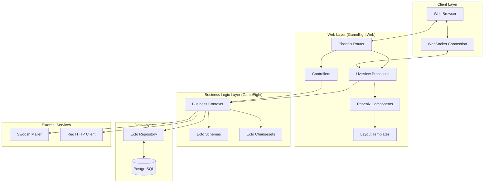

## 2. Component Architecture

### Web Layer Components

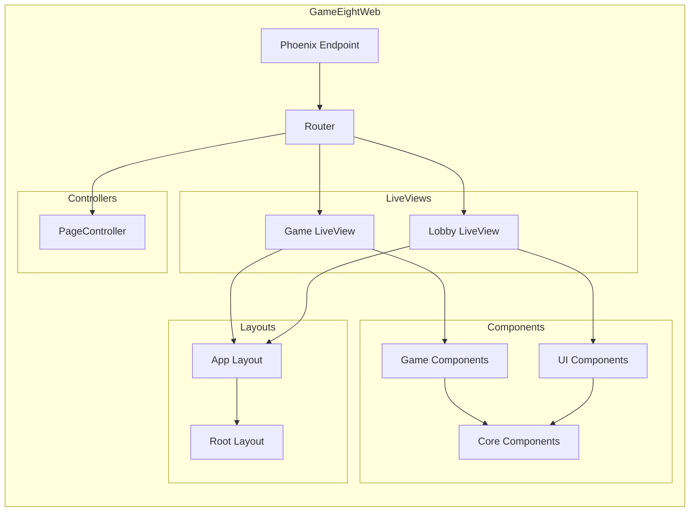

### Business Logic Layer

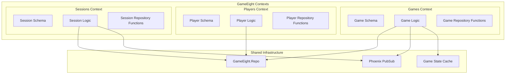

## 3. Data Flow Architecture

### Real-time Game Flow

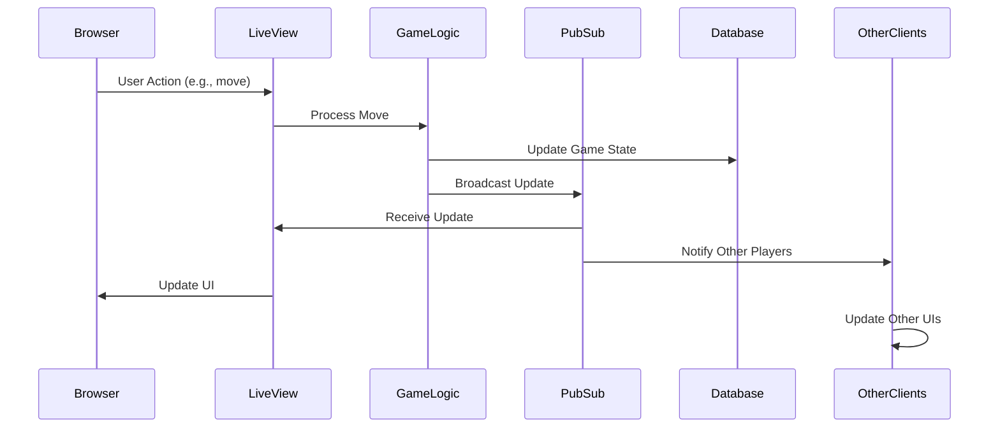

### Request Processing Flow

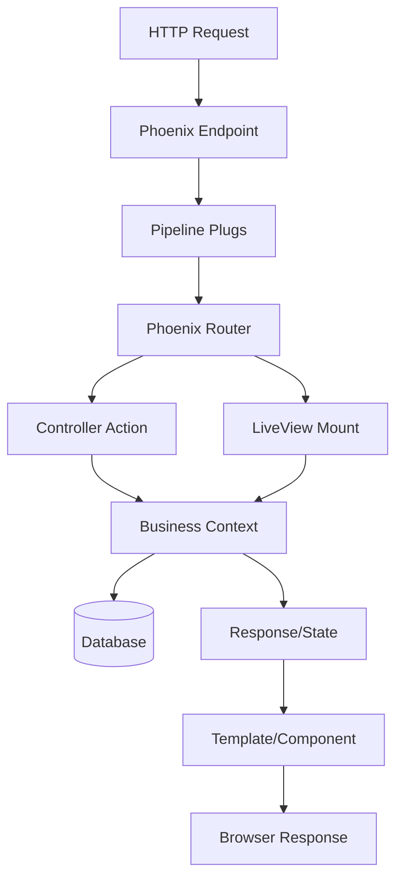

## 4. State Management

### LiveView State Architecture

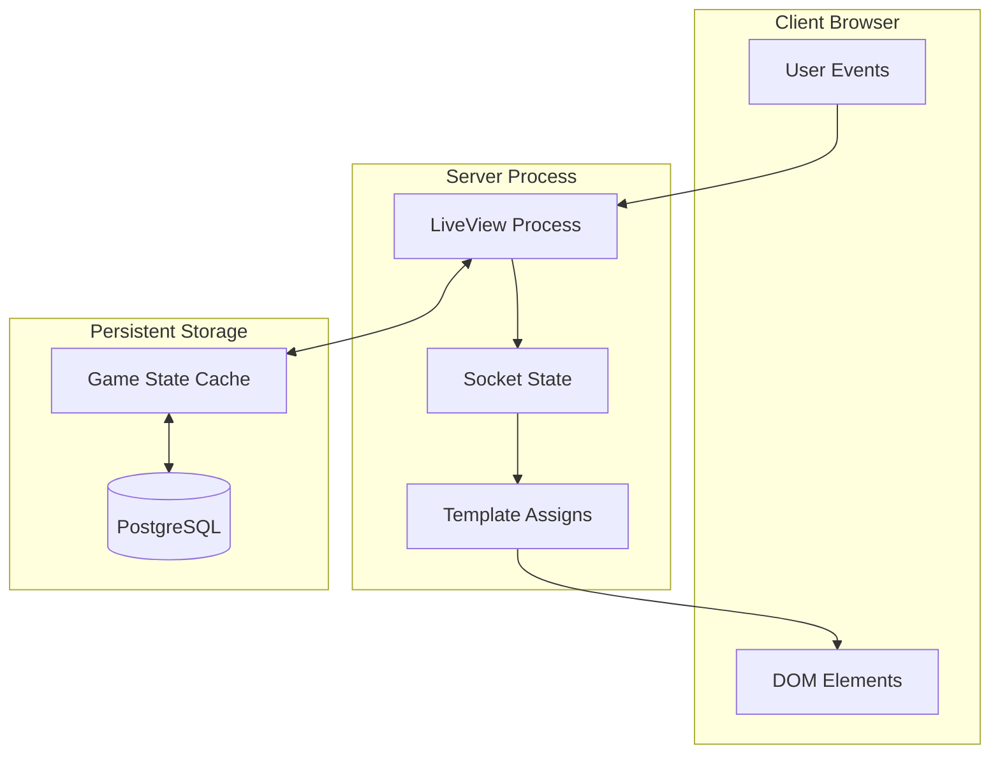

### Game State Management

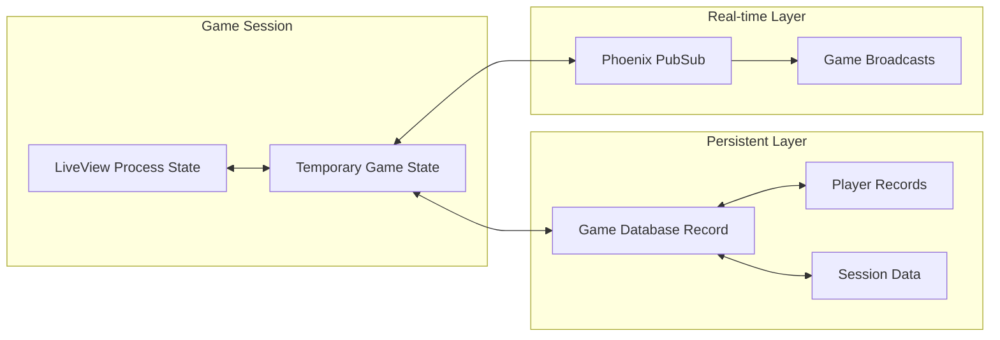

## 5. Security Architecture

### Security Layers

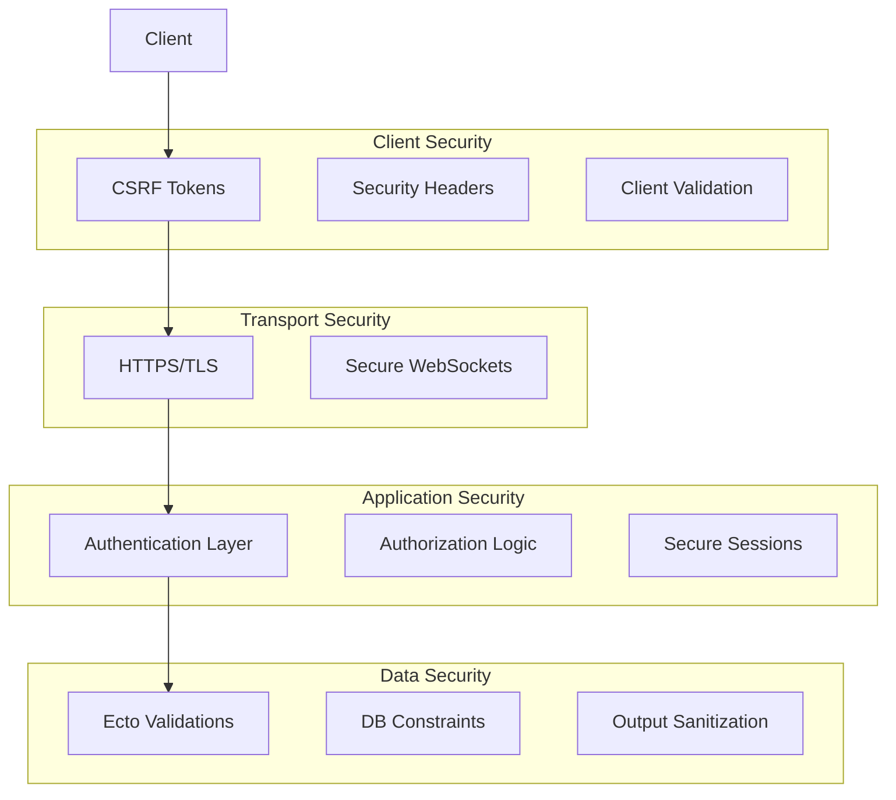

## 6. Scalability Architecture

### Horizontal Scaling Considerations

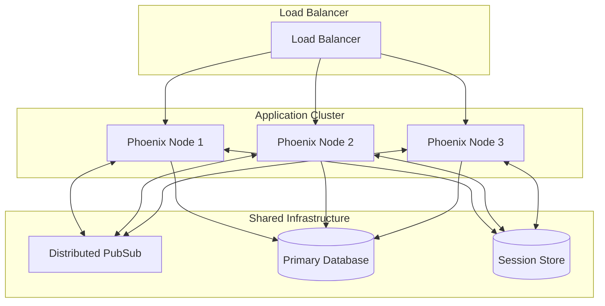

## 7. Integration Architecture

### External Service Integration

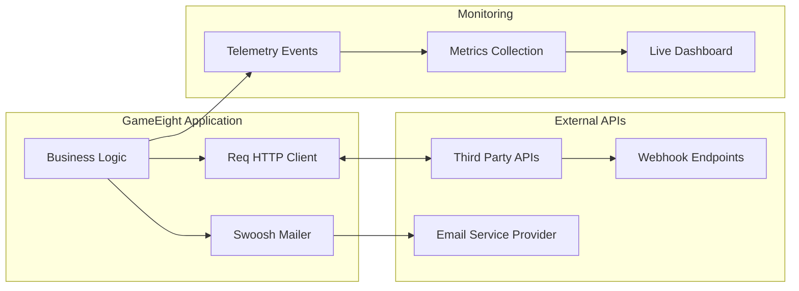

## 8. Development Architecture

### Development Environment

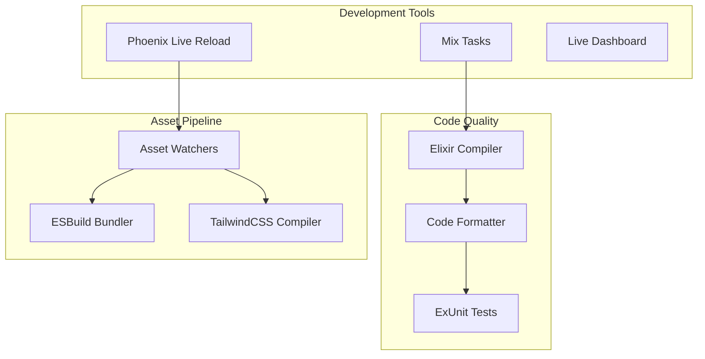

## 9. Deployment Architecture

### Production Deployment

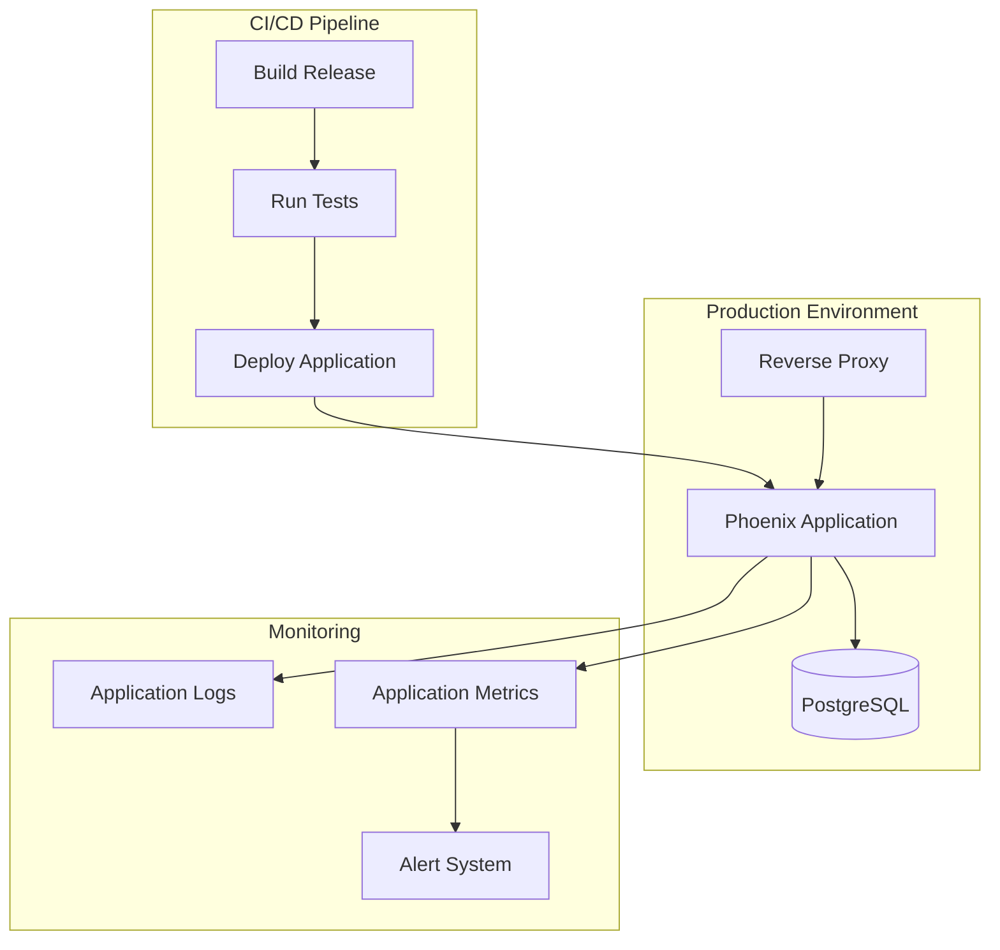

## 10. Component Interaction Patterns

### LiveView Communication Patterns

1. **Parent-Child Component Communication**
   - Parent passes data via assigns
   - Child sends events to parent via `send/2`

2. **Sibling Component Communication**
   - Mediated through parent LiveView
   - Uses Phoenix PubSub for loose coupling

3. **Cross-Process Communication**
   - Phoenix PubSub for real-time broadcasts
   - GenServer processes for stateful operations
   - Database for persistent state sharing

## 11. Error Handling Architecture

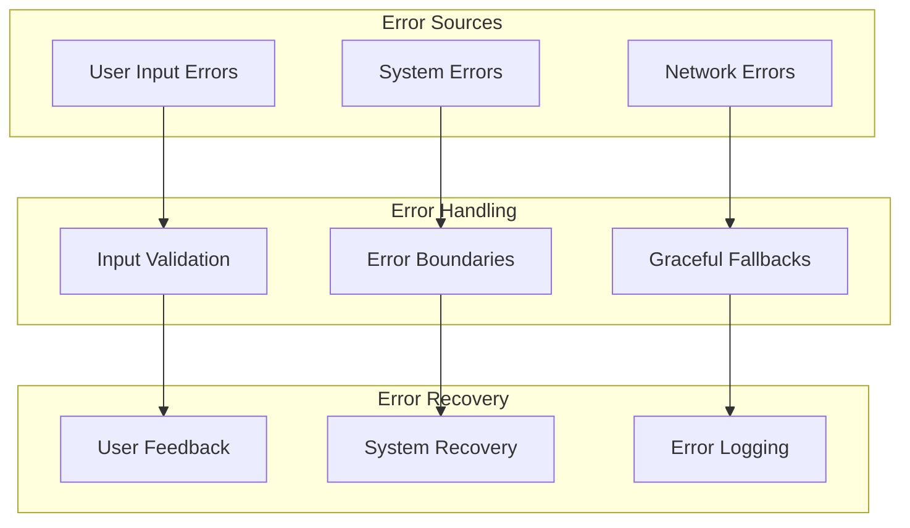
